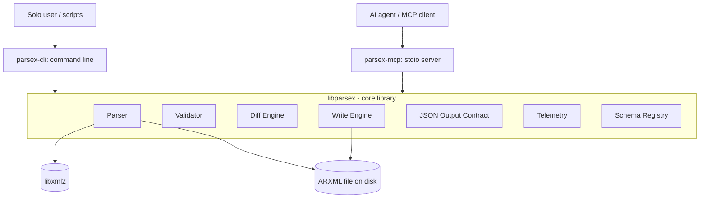
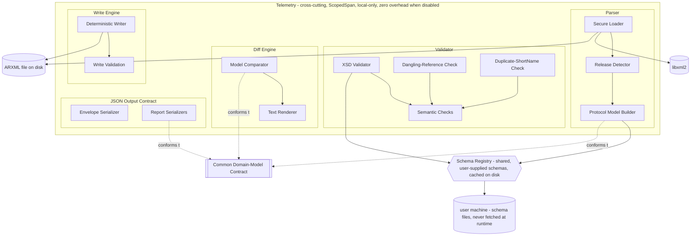
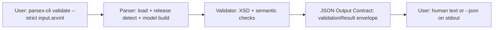
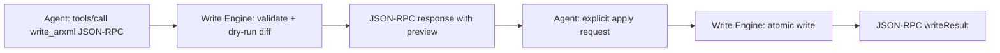

# ParseX — High-Level Design (HLD)

Last updated: 2026-09-25
Status: reconciled against as-built system
Based on: spec.md

## 1. System overview

Diagrams are Mermaid kept in this file so the design stays readable and
versioned. There are no separate draw.io sources.

### System overview

The two surfaces link the same `libparsex` target and never talk to each
other. CMake targets are `libparsex`, `parsex-cli`, and `parsex-mcp`.

### libparsex internals

As built, there is no multi-file resolver, no full-file export writer, and
no network schema fetch. Telemetry surfaces as a `telemetryReport` envelope
on stderr via `--trace`, not an inline timing field.

## 2. Component responsibilities

### Command line (`parsex-cli`)
- Owns: argument parsing (CLI11), subcommand dispatch (`parse`/`validate`/`diff`/`write`), human and `--json` output, sysexits exit codes, `--config` / `--schema-cache-dir` precedence, `--trace` timing to stderr.
- Does NOT own: any parsing/validation/diff/write logic — pure wrapper over `libparsex`.

### Assistant server (`parsex-mcp`)
- Owns: stdio JSON-RPC transport (hand-rolled, stdout pure protocol), tool registry with JSON Schemas, protocol `2026-07-28` handling, dry-run-by-default `write_arxml` with explicit apply.
- Does NOT own: domain logic or report shapes — delegates to `libparsex`. No startup write-enable flag; no separate preview/confirm calls.

### `libparsex` (core library)
- Owns: everything ARXML-specific — parsing, validation, semantic diff, the round-trip write engine, JSON serialization.
- Does NOT own: presentation (CLI text) or transport (MCP) — those belong to its two consumers.

## 2a. Internal breakdown — libparsex

### Parser
1. **Span-Tracking Loader** — single-pass load producing a raw, position-aware tree (every node's exact byte range in the source file recorded as it's parsed, not as a separate post-pass). Owns libxml2 setup and XXE/security hardening (NFR-3).
2. **Release Detector** — reads the AUTOSAR release off the raw tree; rejects anything outside 4.2.2–R21-11 (PBI 1.2/1.3).
3. **Protocol Model Builder** — an extension point behind a common interface, dispatched by detected cluster category. Ships one implementation for v1 (`CanModelBuilder`). Consults the shared **Schema Registry** for structural guidance (what a property should look like for the detected release) while building — this is lighter-weight than full validation, just enough to build correctly. Every implementation builds objects conforming to the **Common Domain-Model Contract** (below). As built, each input file is parsed independently; cross-file short-name stitching is planned, not implemented.

### Validator
1. **XSD Validator** — runs schema validation via libxml2 against the schema the shared Schema Registry resolved; maps violations into the report format with file+element path.
2. **Semantic checks** — dangling references and duplicate short names over the typed domain model, with strict/lenient modes owned by the caller.

(Schema Registry itself moved out of Validator — see Shared/cross-cutting below.)

### Diff Engine
1. **Model Comparator** — walks two typed models, produces a structured added/removed/moved/modified change list with path-based matching and move detection.
2. **Renderers** — deterministic human text plus JSON report via the shared envelope.

### Write Engine
1. **Deterministic Writer** — rebuilds schema-valid output from the typed model with stable ordering and pretty printing. Not a byte splicer: comments and unmodeled content are not preserved (see README limitations).
2. **Write validation + atomic output** — validates before persisting and writes via temp-then-rename so a failure leaves the original intact.

### JSON Output Contract
1. **Envelope Serializer** — the common wrapper (`$schema`, `contractVersion`, `kind`, `payload`, `toolVersion`).
2. **Report serializers** — one per kind (`parseReport`, `validationResult`, `diffReport`, `writeResult`, `telemetryReport`), including `protocolSpecific` handling. No file-export writer as built.

### Shared / cross-cutting
- **Schema Registry** — shared between Parser and Validator. Given a detected AUTOSAR release, resolves it to a local user-supplied XSD file with on-disk caching. No network fetch at runtime; schemas are downloaded by the user ahead of time and never shipped with the repo.
- **Common Domain-Model Contract** — not a runtime component; the base fields every `Cluster`/`Frame`/`Pdu`/`Signal`/etc. must carry regardless of protocol, plus a `protocolSpecific` extension slot on each type.
- **Telemetry** — cross-cutting ScopedSpan timing, local-only. Surfaced as a `telemetryReport` envelope on stderr via `--trace`, with zero overhead when disabled. It never logs file contents or identifying paths.

## 3. Core data flows

1. **Command-line validate:** user → `parsex-cli` → Parser (secure load → release detect → model build, consulting Schema Registry) → Validator (XSD + semantic) → merged report envelope → human text or `--json` on stdout, timing on stderr with `--trace`.
2. **Assistant write:** agent → `parsex-mcp` (`write_arxml`) → Write Engine validates and returns a dry-run preview → agent sends an explicit apply → atomic write → `writeResult` envelope. No server startup flag and no separate confirm-call protocol as built.

## 4. Technology stack

| Component | Language/Framework | Key libraries | Notes |
|---|---|---|---|
| `libparsex` | C++20 | libxml2, nlohmann/json | Core logic; no command-line / server-specific code |
| `parsex-cli` (binary `parsex-cli`) | C++20 | libparsex, CLI11 | Thin wrapper |
| `parsex-mcp` (binary `parsex-mcp`) | C++20 | libparsex, nlohmann/json (hand-rolled stdio transport) | Thin wrapper |
| Tests | C++20 | GoogleTest | + ASan/UBSan, clang-tidy, libFuzzer in CI |

## 5. External interfaces & integrations

| Service/Library | Purpose | Hard dependency? |
|---|---|---|
| libxml2 | XML parsing + XSD validation | Yes |
| nlohmann/json | JSON serialization | Yes |
| CLI11 | Command-line argument/subcommand parsing | Yes (command line only) |
| GoogleTest | Testing | Dev-only |
| vcpkg | Package management | Build-time only |
| User-supplied AUTOSAR schemas | Source for XSD files, downloaded ahead of time via `scripts/download_schemas.py`, cached on disk | Yes, for schema validation specifically |

## 6. Non-functional considerations

- **Expected scale:** single user, run locally — no concurrent-access design needed.
- **Security posture:** untrusted-input hardening (NFR-3) via ASan/UBSan, clang-tidy, libFuzzer, RAII/smart-pointers-only house style (given the C++ implementation choice). No auth/accounts — there's no account model to protect.
- **Availability needs:** "restart if it breaks," no uptime target — this isn't a hosted service.
- **Performance visibility:** Telemetry (above) gives ongoing measurement against the interactive-use target (NFR-5), rather than a one-time benchmark.

## Deployment view

| Component | Runs on |
|---|---|
| `parsex-cli` | User's local machine, invoked directly |
| `parsex-mcp` | User's local machine, launched as a local stdio process by a client |
| `libparsex` | Not deployed independently — linked into the two executables above |

No hosted/cloud component for v1.

## Open questions

- Cross-file reference stitching: single-file parsing as built vs. future project-level resolution.
- Whether comparison needs protocol-aware handling of the `protocolSpecific` slot, or can treat it as opaque (not pressing for CAN-only v1).
