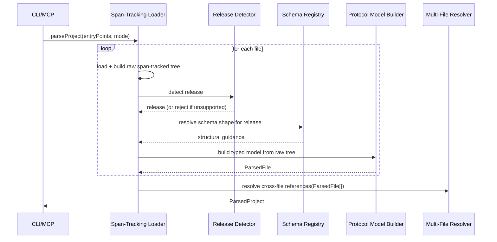
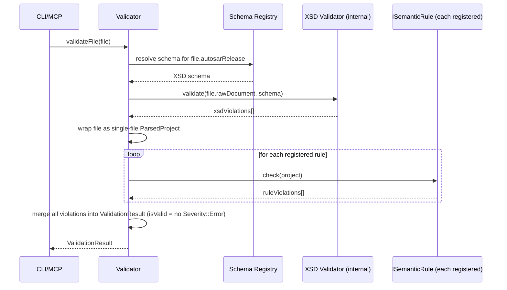
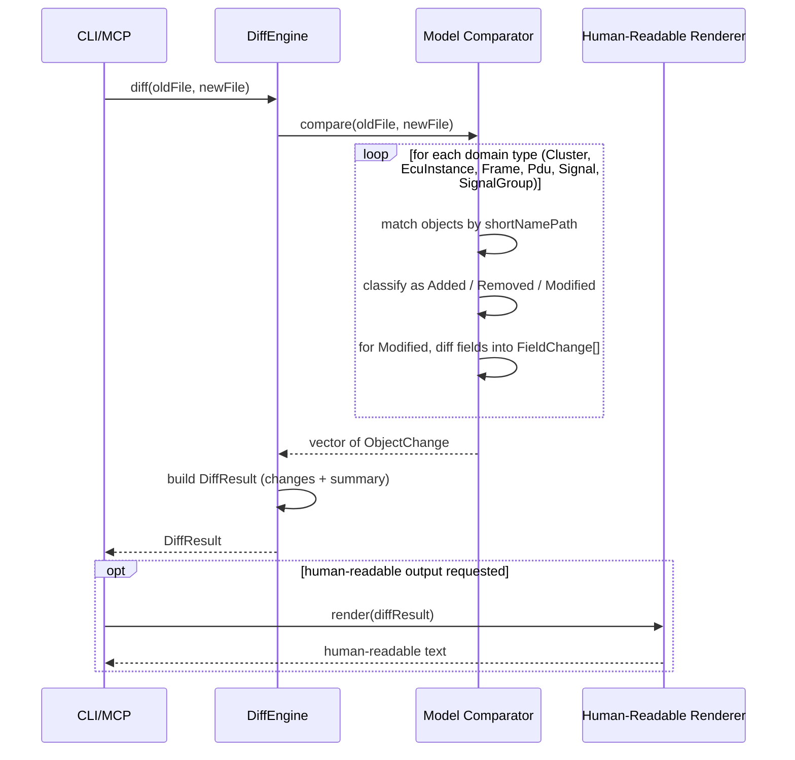
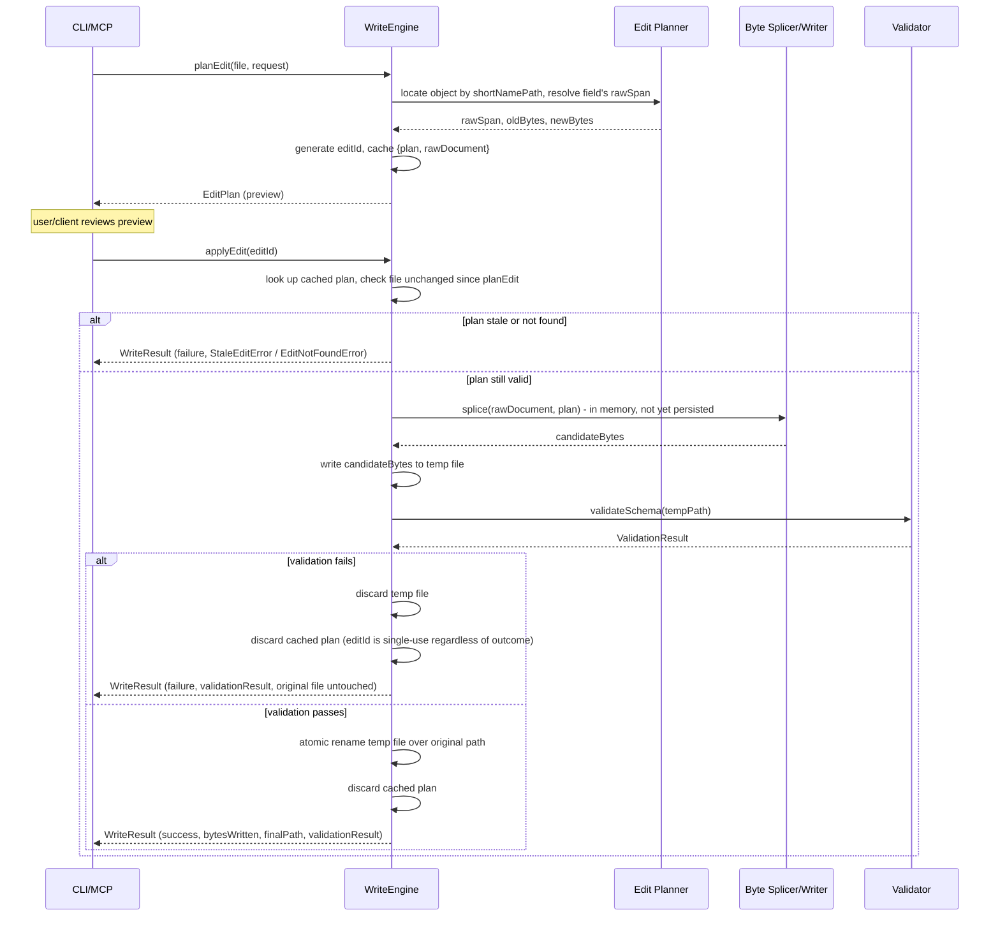
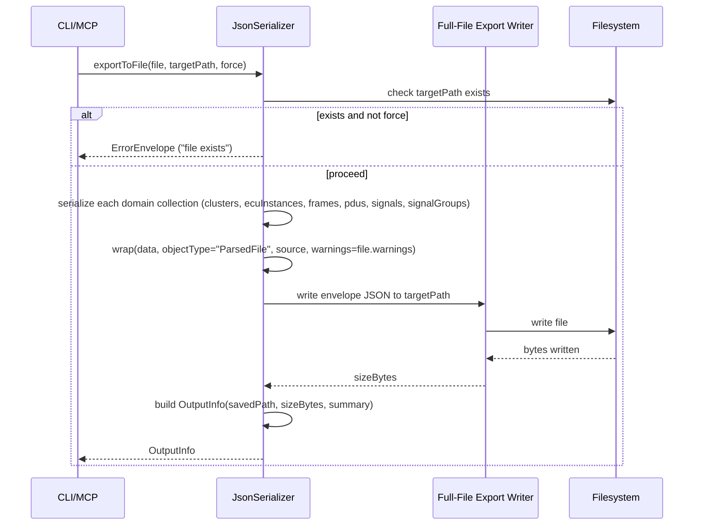
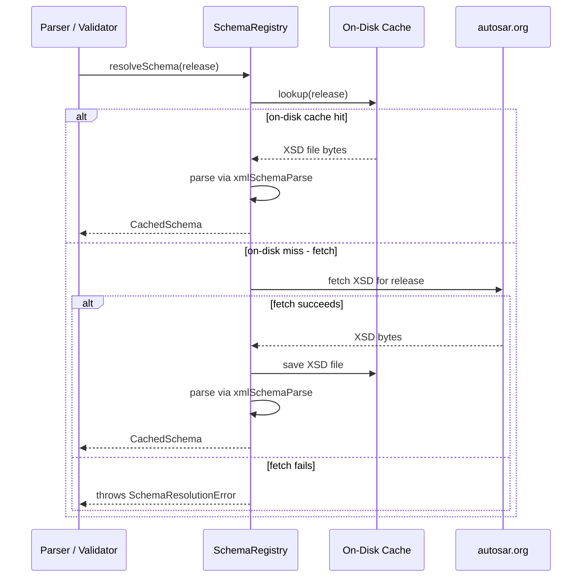
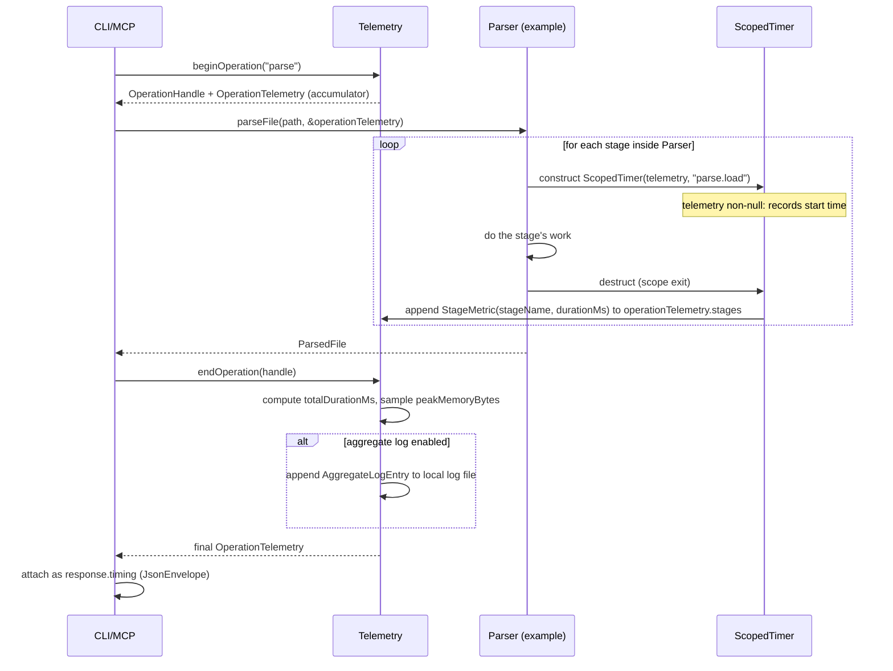

# ParseX — Low-Level Design (LLD)

Last updated: 2026-09-25
Status: reconciled — interface reference below verified against public headers
Based on: hld.md

## Public interface reference (header-verified)

Reference only — signatures plus one-line purpose. Design rationale lives in
the per-component sections below.

- Raw tree (`libparsex/include/parsex/raw/`): `struct RawSpan` with defaulted `operator==` (`raw_span.hpp`); `RawDocument` / `RawNode` (`raw_document.hpp`, `raw_node.hpp`) — position-aware tree every domain object points back into.
- Domain model (`libparsex/include/parsex/model/`): `Cluster`, `EcuInstance`, `Frame`, `Pdu`, `Signal`, `SignalGroup` plus `ParsedFile` / `ParsedProject` (`cluster.hpp`, `ecu_instance.hpp`, `frame.hpp`, `pdu.hpp`, `signal.hpp`, `signal_group.hpp`, `parsed_file.hpp`, `parsed_project.hpp`) — plain aggregates with defaulted `operator==`; constructors only where genuinely needed.
- Parser (`libparsex/include/parsex/parser/parser.hpp`): `class Parser` with `ParsedFile parseFile(path) const`, `ParsedProject parseProject(entryPoints, ...)`, `parseProjectLazy(...)` — stateless, no shared mutable state; errors via `parse_error.hpp` / `release_error.hpp` / `project_error.hpp`.
- Schema Registry (`libparsex/include/parsex/schema/`): `SchemaResolutionResult resolveSchema(...)` (`schema_registry.hpp`); `getCacheDirectory()` / `setCacheDirectoryOverride(dir)` (`cache_layout.hpp`); RAII schema handle (`xml_schema_raii.hpp`); atomic output helpers (`atomic_write.hpp`).
- Validator (`libparsex/include/parsex/validator/`): `class Validator` with `ValidationResult validateAll(project, sharedSchema) const`, `static bool overallPassed(result, StrictMode)` (`validator.hpp`); `struct ValidationResult` with `hasErrors()`, `merge(other)`, `toJson()` (`validation_result.hpp`).
- Diff Engine (`libparsex/include/parsex/diff/`): `class DiffEngine` with `DiffReport diff(oldProject, newProject, ...)` (`diff_engine.hpp`); `DiffReport` with `empty()`, `toText()`, `toJson()` (`diff_report.hpp`); matching/move/populate helpers (`diff_match.hpp`, `diff_moves.hpp`, `diff_populate.hpp`, `diff_fields.hpp`, `diff_nested.hpp`).
- Write Engine (`libparsex/include/parsex/write/`): `class WriteEngine` with `ValidationResult validate(project) const`, `void write(project, outputPath) const` (`write_engine.hpp`) — dry-run via `validate`, apply via `write`; ordering/format/context helpers (`write_ordering.hpp`, `write_format.hpp`, `write_context.hpp`, `write_elements.hpp`). Invariant: parse-write-reparse is idempotent; output is deterministic pretty print, not byte passthrough.
- JSON Output Contract (`libparsex/include/parsex/json_contract/`): `wrapEnvelope(kind, payload)` (`envelope.hpp`); `kContractVersion = "1.0.0"` (`version.hpp`); schema validation helper (`schema_validate.hpp`). Envelope: `$schema`, `contractVersion`, `kind`, `payload`, `toolVersion` (`toolVersion` from `libparsexVersion()`).
- Telemetry (`libparsex/include/parsex/telemetry/`): `class ScopedSpan` (`scoped_span.hpp`, `PARSEX_SPAN` in `scoped_span_macro.hpp`); `TelemetryConfig::setEnabled(bool)` (`telemetry_config.hpp`); `TelemetryContext::currentTraceAsJson()` (`telemetry_context.hpp`); span/trace/id/status/attribute types (`span.hpp`, `trace.hpp`, `span_id.hpp`, `span_status.hpp`, `attribute.hpp`, `operation_telemetry.hpp`). Zero overhead when disabled; surfaces as `telemetryReport` on stderr via `--trace`.
- Version (`libparsex/include/parsex/version.hpp`): `libparsexVersion()` — single tool-version source consumed by command line `--version` and every envelope's `toolVersion`.
- Assistant error model: transport-level JSON-RPC `error` for protocol failures vs. tool-result `isError:true` for engine failures (see `parsex-mcp/dispatch.hpp`) — callers distinguish "call failed" from "tool ran and reported a problem".

## Components getting full LLD treatment

Full LLD pass: Parser, Validator, Diff Engine, Write Engine, JSON Output Contract, Schema Registry, Telemetry — these are libparsex's internal blocks and carry the real design risk.

Lighter pass: CLI, MCP Server — these are thin adapters over libparsex's public API, so they get a brief note instead of full data-model/sequence-diagram treatment (see "Lightweight components" at the end).

**Key architectural decision confirmed during this pass:** Parser and Validator are fully independent — neither references the other. Sequencing decisions that combine them (e.g. "validate schema, then parse") are made by the CLI/MCP layer, not embedded inside either block. See the CLI section under "Lightweight components" for the three resulting command modes.

**Amendment (added once Telemetry's LLD was designed):** Parser, Validator, Diff Engine, Write Engine, and Schema Registry's public methods each gained one additional parameter — `OperationTelemetry* telemetry = nullptr` — so the CLI/MCP layer can opt into stage-level timing without any block needing to know about the others. Because it's a defaulted pointer, every sequence diagram and usage example already confirmed above stays valid exactly as drawn; a caller that passes nothing gets zero telemetry overhead (a single pointer-null check per instrumented stage, nothing else). See Component: Telemetry below for the full design and the performance guarantee behind this choice.

---

## Component: Parser

**Status: CONFIRMED**

### Data model

```
DomainObjectBase
  shortName: string, required
  category: string, optional
  rawSpanRef: RawSpan
  protocolSpecific: variant<CanExtension, ...>, optional

Cluster : DomainObjectBase
  baudrate: uint32, optional
  physicalChannels: vector<string>

EcuInstance : DomainObjectBase
  connectedChannels: vector<string>
  controllers: vector<string>

Frame : DomainObjectBase
  length: uint32, required
  transmitters: vector<string>
  pdus: vector<{ pduShortNameRef: string, startPosition: uint32 }>

Pdu : DomainObjectBase
  length: uint32, required
  signalMappings: vector<{ signalShortNameRef: string, startPosition: uint32, byteOrder: enum }>

Signal : DomainObjectBase
  startBit: uint32, required
  bitLength: uint32, required
  byteOrder: enum, required
  signed: bool, required
  factor: double, default 1.0
  offset: double, default 0.0
  min, max, unit, initValue: optional
  receivers: vector<string>
  valueTable: vector<{ value: int64, label: string }>, optional

SignalGroup : DomainObjectBase
  members: vector<string>

ParsedFile
  autosarRelease: string
  sourcePath: filesystem::path
  rawDocument: shared_ptr<RawDocument>   // the one-time raw parse (RAII-owned xmlDocPtr + byte-span tree); shared onward so Validator's validateFile() can reuse it without re-parsing
  clusters, ecuInstances, frames, pdus, signals, signalGroups: vector<...>
  warnings: vector<Warning>

ParsedProject
  files: vector<ParsedFile>
  resolvedRefs: map<shortNamePath, ResolvedReference>
```

Fields mirror `JSON_OUTPUT_SHAPE.md`'s domain object shapes, plus `rawSpanRef` (back-reference into the raw byte-span tree, used by the Write Engine) and `protocolSpecific` (the extension slot from the Common Domain-Model Contract, keeping the door open for non-CAN protocols later without changing this shape). `rawDocument` was added after confirming Parser and Validator shouldn't each independently re-load the same file when Validator is handed an already-parsed `ParsedFile` — this is a case of the caller passing along data it already has, not a shared internal component between the two blocks.

### API contract

```cpp
class Parser {
public:
    ParsedFile parseFile(const std::filesystem::path& path, OperationTelemetry* telemetry = nullptr);

    ParsedProject parseProject(const std::vector<std::filesystem::path>& entryPoints,
                                FileDiscoveryMode discoveryMode,
                                OperationTelemetry* telemetry = nullptr);
};

enum class FileDiscoveryMode {
    ExplicitList,     // only the given entry points are parsed
    DirectoryScan,     // scan the containing directory for related ARXML files
    LazyOnReference    // resolve additional files only as cross-file references demand them
};
```

No mode parameter here — Parser always does the same thing (best-effort model + warnings). Whether an XSD gate runs *before* this is called is a decision made by the caller (CLI/MCP layer), not by Parser itself. See "Lightweight components → CLI" below.

### Sequence diagram — parse a multi-file project



### Internal design

A single-pass walk (libxml2's reader API) over the document builds a raw node tree as it goes: for each element, the loader records the byte offset where the element opens and where it closes, plus its tag name, attributes, parent pointer, and ordered children. This raw tree plus the owning `xmlDocPtr` together form the `RawDocument` referenced from the data model above. The Protocol Model Builder then walks this raw tree and projects it into the typed domain objects, with each typed object's `rawSpanRef` pointing back into the corresponding raw node. This back-reference is what lets the Write Engine later splice bytes surgically instead of re-serializing the whole file.

**Flagged as a prototype-spike item** before real implementation: libxml2's reader API exposes line/column more directly than raw byte offsets, and exact behavior can vary by libxml2 version. If the reader API doesn't give reliable byte offsets, the fallback is a custom input callback that counts bytes itself as libxml2 consumes the stream. Worth a small throwaway spike to confirm which path is needed before committing to the approach in code.

### State management

Parser is stateless. No mutable state is shared across calls — each `parseFile`/`parseProject` call is independent. This also means parsing multiple files in parallel is safe in the future, as long as the underlying libxml2 contexts are kept thread-local.

### Error handling

| What can go wrong | Detected by | How it's handled |
|---|---|---|
| File not found / unreadable | Loader, before parsing starts | `ParseError` (I/O) |
| Malformed XML | Loader, during libxml2 parse | `ParseError` (Syntax), carries libxml2's line/col |
| XXE / external entity attempt | Loader (libxml2 configured to refuse external entity resolution) | Rejected safely, `ParseError` (Security), no crash — satisfies NFR-3 |
| Unsupported AUTOSAR release (outside 4.2.2–R21-11) | Release Detector, before model building | `UnsupportedReleaseError` |
| Referenced file not found (multi-file project) | Multi-File Resolver | `DanglingFileReferenceError` |
| Schema-expected element/attribute missing | Protocol Model Builder, via Schema Registry's structural guidance | Attached as a **warning** on `ParsedFile.warnings` — not a hard error, since only the Validator produces hard conformance failures |

---

## Component: Validator

**Status: CONFIRMED — full LLD complete (data model, API contract, sequence diagram, internal design, state management, error handling).**

### Data model

```
enum class Severity { Error, Warning, Info };

RuleViolation
  ruleId: string           // e.g. "dangling-reference", "duplicate-short-name", "xsd-schema"
  severity: Severity
  message: string          // human-readable
  shortNamePath: string    // where in the model this occurred
  location: optional<RawSpan>  // byte span in source, when available, for tooling to highlight

ValidationResult
  isValid: bool             // false if any Severity::Error present
  violations: vector<RuleViolation>
  autosarRelease: string
  sourcePath: string        // or project identifier for multi-file

ISemanticRule (interface)
  ruleId() -> string
  check(const ParsedProject&) -> vector<RuleViolation>
```

Two v1 implementations of `ISemanticRule`: `DanglingReferenceRule` (checks every `*ShortNameRef` field resolves to an existing object) and `DuplicateShortNameRule` (checks short-name uniqueness within the relevant scope per AUTOSAR's short-name path rules).

### API contract(s)

```cpp
class Validator {
public:
    explicit Validator(SchemaRegistry& registry);

    // Full validation: XSD + semantic rules. Requires an already-built model.
    // Reuses file.rawDocument / each file's rawDocument — no re-parsing.
    ValidationResult validateFile(const ParsedFile& file, OperationTelemetry* telemetry = nullptr);
    ValidationResult validateProject(const ParsedProject& project, OperationTelemetry* telemetry = nullptr);

    // XSD-only structural check, usable standalone before any model exists.
    // Loads and parses the raw XML independently of Parser — no shared state.
    ValidationResult validateSchema(const std::filesystem::path& path, OperationTelemetry* telemetry = nullptr);

    void registerRule(std::unique_ptr<ISemanticRule> rule);
};
```

`validateSchema()` detects the AUTOSAR release itself (recorded in the returned `ValidationResult::autosarRelease`) and resolves the matching XSD via the Schema Registry — it does not depend on Parser's Release Detector or Loader. This is what makes it usable ahead of parsing, e.g. for `parsex parse --strict` (see "Lightweight components → CLI" below), without introducing any dependency between Parser and Validator.

### Sequence diagram — validate flow



Notes:
- `XSD Validator (internal)` is the HLD's sub-block, not a separate public class — shown here to keep the schema pass and the semantic pass visually distinct. It reuses `file.rawDocument`, so no re-parsing happens (per the earlier `rawDocument`-sharing decision).
- The "wrap as single-file ParsedProject" step exists because `ISemanticRule::check()` always takes a `ParsedProject` — `validateFile()` wraps its single `ParsedFile` to reuse that same interface, so rule implementations don't need a separate single-file code path.
- `validateProject()` follows the same shape, except the XSD check loops once per file, and the semantic rules run directly against the real multi-file `ParsedProject` (no wrapping needed) — this is what makes cross-file dangling-reference checks meaningful.
- `validateSchema(path)` (the standalone, pre-parse method used by `parsex parse --strict`) is simpler and not diagrammed separately: Caller → Validator → Registry → XsdCheck → Caller, with no semantic rules involved since there's no model yet to run them against.

### Internal design

`registerRule()` follows the same compile-time extensibility pattern as the Protocol Model Builder (from the HLD) — rules are C++ classes implementing `ISemanticRule`, registered by a constructor call, not loaded dynamically from plugin files at runtime. This keeps the same memory-safety posture (no `dlopen`, no untrusted-code-loading) that drove the earlier decision to reject runtime plugin loading.

In practice, v1 ships a small factory:

```cpp
Validator createDefaultValidator(SchemaRegistry& registry) {
    Validator validator(registry);
    validator.registerRule(std::make_unique<DanglingReferenceRule>());
    validator.registerRule(std::make_unique<DuplicateShortNameRule>());
    return validator;
}
```

so the CLI/MCP layer gets a fully-configured Validator without needing to know which rules exist. Adding a new semantic rule later (e.g. for a future protocol) means writing one more `ISemanticRule` implementation and adding one more `registerRule()` call here — no changes to Validator itself.

Two design constraints for rule authors, worth stating explicitly since they affect correctness: rules must be **independent of each other** (no rule may depend on another rule's violations to decide its own — this keeps execution order irrelevant, and lets rules run in any order, even in parallel later if needed), and every violation a rule produces must carry a `ruleId` matching `ISemanticRule::ruleId()`, so violations are traceable back to the rule that raised them. XSD-originated violations get a fixed synthetic `ruleId` of `"xsd-schema"` so they sit in the same `RuleViolation` list uniformly rather than needing a separate shape.

The merge step itself is simple: `ValidationResult.violations` is just the concatenation of the XSD pass's violations and every registered rule's violations, and `isValid` is computed as "no violation has `Severity::Error`" — warnings and info-level violations don't fail validation, matching the same severity distinction used in Parser's warnings.

### State management

Validator is not fully stateless like Parser, but its only state is the list of registered rules — set once at construction (typically via `createDefaultValidator()`), never mutated per-call. Since `validateFile()`/`validateProject()`/`validateSchema()` don't touch or modify that list, a single `Validator` instance is safe to reuse across multiple validate calls, including concurrently, as long as `registerRule()` isn't called after setup completes (a "configure once, then use" lifecycle — worth documenting on the class itself so a future contributor doesn't call `registerRule()` mid-flight).

### Error handling

A file merely *failing* validation is not an error in the exception sense — that's the expected outcome, returned as `ValidationResult{isValid: false, violations: [...]}`. The table below covers only what stops validation from running at all.

| What can go wrong | Detected by | How it's handled |
|---|---|---|
| Schema Registry can't resolve/fetch the XSD for the detected release (network failure, first-use cache miss) | Schema Registry, surfaced to Validator | `SchemaResolutionError` — the call fails outright, no `ValidationResult` returned (this is an inability to validate, not a finding) |
| `validateSchema(path)`: file not found/unreadable, malformed XML, XXE attempt | Validator's own independent load (same categories as Parser's Loader, since this method loads the file itself) | Same error types as Parser: `ParseError` (I/O / Syntax / Security) — can't validate without a loaded document |
| File loads fine but fails XSD schema validation | XSD Validator (internal), during the schema check | **Not an error** — the expected outcome, reported as `RuleViolation` entries (`ruleId="xsd-schema"`) inside a normally-returned `ValidationResult` with `isValid=false` |
| A registered `ISemanticRule` throws during `check()` (a buggy rule) | Validator, wrapping each rule's `check()` call | Caught and converted into a `RuleViolation` (`severity=Error`, `ruleId="internal-rule-error"`, message includes the exception text) rather than propagating a crash — one bad rule shouldn't take down the whole validate call |

---

## Component: Diff Engine

**Status: CONFIRMED — full LLD complete (data model, API contract, sequence diagram, internal design, state management, error handling).**

### Data model

```
enum class ChangeType { Added, Removed, Modified };

FieldChange
  fieldName: string          // e.g. "factor", "length" - dotted path for nested/protocolSpecific fields
  oldValue: string           // stringified for uniform diff display
  newValue: string

ObjectChange
  objectType: string         // "Cluster" | "EcuInstance" | "Frame" | "Pdu" | "Signal" | "SignalGroup"
  shortNamePath: string      // identifies which object changed
  changeType: ChangeType
  fieldChanges: vector<FieldChange>   // empty for Added/Removed; populated for Modified

DiffResult
  oldSourcePath: filesystem::path
  newSourcePath: filesystem::path
  autosarRelease: string      // assumes both revisions are the same release; mismatches are a separate error case
  changes: vector<ObjectChange>
  summary: string             // one-line human-readable summary, e.g. "3 changed, 1 added, 0 removed"
```

`fieldName` is stringified rather than strongly typed per domain type, since `ObjectChange` needs to describe changes across six different domain types uniformly — the JSON Output Contract's serializer re-types values as needed for the JSON envelope, while the human-readable renderer just uses the strings directly (e.g. "signal EngineSpeed's factor changed from 0.25 to 0.5", matching the example from spec.md's Feature: Semantic diff). This also resolves the open question flagged in `hld.md` about the Model Comparator's protocolSpecific-awareness: since v1 only has one `protocolSpecific` variant (`CanExtension`), its fields are compared the same way as any other typed field and reported with a dotted `fieldName` (e.g. `protocolSpecific.someField`) rather than needing a generic reflection system — that can be revisited if/when a second protocol extension is added.

### API contract(s)

```cpp
class DiffEngine {
public:
    DiffResult diff(const ParsedFile& oldFile, const ParsedFile& newFile, OperationTelemetry* telemetry = nullptr);
};
```

Design notes:
- Inputs are `ParsedFile`, not raw paths — Diff Engine sits downstream of Parser. The caller (CLI/MCP) parses both revisions first (`Parser::parseFile()`, best-effort mode is fine since diffing doesn't need strict schema conformance) and hands the two typed models to `diff()`. Same independence principle as Validator: Diff Engine only depends on the public `ParsedFile` shape, not Parser's internals.
- No `diffProject()` overload for multi-file projects in v1 — spec.md's Feature: Semantic diff describes comparing "two revisions of an ARXML file," singular. Multi-file project diffing (matching files across two project trees, handling renamed/moved files) is a meaningfully harder problem not covered by v1's acceptance criteria — an explicit scope boundary, not a silent omission.
- A release mismatch between `oldFile` and `newFile` is not rejected at the type level (diffing across an AUTOSAR version migration is a valid, if unusual, request) — it's handled as an error-handling case instead (see below).

### Sequence diagram — diff flow



Notes:
- Objects are matched by `shortNamePath`, not position or insertion order — this is the load-bearing assumption behind Added/Removed/Modified classification: AUTOSAR short-name paths are meant to be stable identity, not just labels.
- The Human-Readable Renderer is invoked by the caller, not automatically by `DiffEngine::diff()` — `diff()` always returns the structured `DiffResult`; rendering to human-readable text is a presentation decision the CLI makes based on requested output format, matching spec.md's "output is available in both human-readable and JSON form" without forcing DiffEngine to always do both. Same CLI-orchestrates-presentation pattern as the parse/validate sequencing decided earlier.

### Internal design

The Model Comparator builds a `map<shortNamePath, object>` for each of the six domain-type collections in both `oldFile` and `newFile`. For each type: keys only in `newFile` → Added, keys only in `oldFile` → Removed, keys in both → field-by-field compared via a per-type comparison function (`compareCluster`, `compareEcuInstance`, `compareFrame`, `comparePdu`, `compareSignal`, `compareSignalGroup`) — six hand-written comparators rather than a generic reflection system, since C++ has no runtime reflection and the domain types are small and fixed for v1.

Field comparison rules:
- Scalar fields (numbers, strings, enums, bools): simple inequality check, reported as one `FieldChange`.
- Vector fields (e.g. `transmitters`, `receivers`, `valueTable`, `pdus`, `signalMappings`, `members`): compared as a single field-level change if the vectors differ at all — the old/new values are stringified as lists. Element-by-element diffing within a vector field is not attempted in v1; spec.md's acceptance criteria only calls for "meaningful model changes" like a scalar factor change, not fine-grained list diffing.
- `rawSpanRef` is excluded from comparison entirely — it's an implementation detail (byte position in the source file), not model content, and would produce meaningless "changes" for content that's semantically identical but physically relocated in the file.
- `protocolSpecific` fields are compared the same way as any other typed field (per the data-model discussion).
- Element order within the original XML doesn't affect the diff — Parser's typed collections have already discarded positional information relative to sibling elements, so the diff naturally ignores pure reordering. (Byte-level ordering still matters to the Write Engine for round-trip fidelity — that's a separate concern at a different layer.)

`DiffResult.summary` is a simple count-based string, e.g. `"3 changed, 1 added, 0 removed"`, derived directly from the `changes` vector's `ChangeType` tally.

### State management

DiffEngine is stateless, like Parser — no mutable state across calls, each `diff()` call is fully independent of any other.

### Error handling

| What can go wrong | Detected by | How it's handled |
|---|---|---|
| `oldFile.autosarRelease != newFile.autosarRelease` | DiffEngine, at the start of `diff()` | Not rejected — `DiffResult` is still produced, but a warning notes the release mismatch, since a version-migration diff is a legitimate use case the caller should just be aware of |
| A `shortNamePath` appears more than once within a single file (should be impossible if Validator's `DuplicateShortNameRule` passed, but Diff Engine doesn't require validation first) | Model Comparator, while building the `map<shortNamePath, object>` | Later occurrence wins silently in the map build, but a warning is attached noting the duplicate — enforcing uniqueness is Validator's job, not Diff Engine's |
| Cross-protocol diff (not applicable in v1 — CAN only) | N/A for v1 | Not handled — no cross-protocol diff exists to fail; noted only so it isn't forgotten if a second protocol is added later |

---

## Component: Write Engine

**Status: CONFIRMED — full LLD complete (data model, API contract, sequence diagram, internal design, state management, error handling).**

### Data model

```
EditRequest
  shortNamePath: string        // which object to edit
  fieldName: string            // which field - dotted path, consistent with Diff Engine's FieldChange.fieldName
  newValue: string             // stringified new value; Edit Planner interprets/validates the type per field

EditPlan
  editId: string                // opaque handle tying this specific planned edit to a later confirm/apply call
  request: EditRequest
  rawSpan: RawSpan               // exact byte range in the source file that will change
  oldBytes: string               // preview: current bytes at that span
  newBytes: string               // preview: bytes that will replace them
  sourcePath: filesystem::path

WriteResult
  success: bool
  bytesWritten: uint64
  finalPath: filesystem::path
  validationResult: optional<ValidationResult>   // populated by the post-edit validation gate (FR-16 / NFR-4)
```

`EditPlan` is deliberately shaped to double as the FR-17 preview — it's what gets shown to an MCP client (or CLI user) before anything touches disk, and it carries an `editId` so a later confirm call can unambiguously refer back to the exact plan that was previewed rather than re-deriving it.

**Scope decision:** v1 supports one field edit per `EditRequest`/`EditPlan`, not a batch of edits in one write. Spec.md's worked example (`FACTOR` 0.25→0.5) and the MCP write-tools feature both describe a single targeted edit; multi-edit transactions are an explicit v2+ candidate, deferred rather than decided now — batching would change the `applyEdit` design below (e.g. whether it takes one `editId` or a set), so that call is intentionally left for when batching is actually introduced.

### API contract(s)

```cpp
class WriteEngine {
public:
    EditPlan planEdit(const ParsedFile& file, const EditRequest& request, OperationTelemetry* telemetry = nullptr);

    WriteResult applyEdit(const std::string& editId, OperationTelemetry* telemetry = nullptr);
};
```

`applyEdit` takes just the `editId`, not the full `EditPlan`. `WriteEngine` holds pending plans internally, keyed by `editId`, together with the `RawDocument` they were computed against — `planEdit()` creates and caches one, `applyEdit(editId)` looks it up. This means Write Engine is **not stateless** like Parser and Diff Engine (see State management below), but it buys two things: the plan's byte-position guarantees survive intact between preview and confirm without being round-tripped through an external client as data, and `applyEdit` has a natural place to check whether the source file changed on disk since the plan was made — applying stale byte offsets would risk exactly the corruption NFR-4 exists to prevent.

Batch editing (multiple `editId`s applied together, or one `EditPlan` covering several fields) is deferred to when it's actually needed, per the scope decision above.

### Sequence diagram



Notes:
- The staleness check exists specifically for NFR-4: if the file changed on disk between `planEdit` and `applyEdit`, the cached byte offsets could point at the wrong place, so `applyEdit` verifies the file is unchanged before splicing.
- Validation happens on a temp file, never the live file — candidate bytes are spliced in memory, written to a temp file, and *that* gets schema-validated via `Validator::validateSchema()` (reused from Validator's own contract, not duplicated). Only on a pass does the temp file get atomically renamed over the original. Before the rename, the original file is completely untouched; the rename itself is a single atomic filesystem operation — this is what makes NFR-4 concrete rather than aspirational.

### Internal design

**Shared Field-to-Tag Mapping.** Edit Planner needs to turn a domain field name (e.g. `Signal.factor`) into the exact raw XML location to splice — but a domain object's `rawSpanRef` only covers the whole raw element (e.g. all of `<SIGNAL>...</SIGNAL>`), not any one field within it. Protocol Model Builder already has this exact knowledge in the opposite direction (raw tag → domain field, used when building the typed model). Rather than let Edit Planner re-derive this independently and risk drifting out of sync as AUTOSAR coverage grows, both consult one shared, static, read-only **Field-to-Tag Mapping** table (one per domain type):

```
FieldToTagMapping (per domain type, illustrative - exact AUTOSAR tags finalized during implementation)
  fieldName -> { rawLocation: Attribute | ElementText, tagOrAttrName: string }

  e.g. for Signal:
    factor    -> { ElementText, "FACTOR" }
    startBit  -> { ElementText, "START-POSITION" }
```

This is plain data, not a stateful shared component — low coupling risk, same reasoning as sharing `rawDocument` between Parser and Validator.

**Edit Planner's steps** for `planEdit(file, request)`:
1. Look up the target object by `shortNamePath` in `file`'s typed collections (same map-lookup pattern as Diff Engine's Model Comparator).
2. Resolve `request.fieldName`'s raw location via the Field-to-Tag Mapping for that object's domain type.
3. Walk from the object's `rawSpanRef` node to the specific child element or attribute in the raw tree.
4. Read that node's byte span as `rawSpan`; extract `oldBytes` from the `RawDocument`'s buffer at that span.
5. Serialize `request.newValue` into the field's expected raw text format (e.g. a `double` formatted to match AUTOSAR's typical numeric conventions) as `newBytes`.
6. Package `rawSpan`, `oldBytes`, `newBytes` into the `EditPlan`.

**Byte Splicer** is simple buffer concatenation: `candidateBytes = originalBytes[0:rawSpan.start] + newBytes + originalBytes[rawSpan.end:]` — no re-serialization of anything else in the file. Because v1 supports only one edit per plan (per the earlier scope decision), there's no need to handle cascading offset shifts from multiple edits landing in the same buffer.

### State management

Write Engine holds an in-memory map of pending edits, keyed by `editId`: `map<editId, {EditPlan, shared_ptr<RawDocument>}>`. This is the one piece of real mutable state anywhere in libparsex's core blocks (everything else — Parser, Diff Engine — is stateless; Validator's only state is its immutable rule list).

Per spec.md, write access is exposed only through the **MCP server** (`parsex mcp --allow-write`) — the CLI's confirmed feature set (parse/validate/diff/export) has no write subcommand. That matters here because the MCP server is a long-running process, so the pending-edit map naturally lives for the server's lifetime; there's no cross-process persistence concern to design for in v1, since a CLI invocation never needs to hold a pending edit between two separate process runs.

Lifecycle per edit: **Planned** (created by `planEdit`, awaiting confirmation) → **Applied** or **Failed** (both terminal — `applyEdit` discards the cached plan on either outcome, since `editId` is single-use regardless of success or failure; a client that wants to retry a failed edit submits a new `EditRequest` via `planEdit`, getting a fresh `editId`, rather than reusing the old one). There's also an implicit **Expired** path: a plan that's previewed but never confirmed needs a bound on how long it's held, or a long-lived MCP server session could accumulate unconfirmed plans indefinitely. Proposing a simple TTL (e.g. 15 minutes, checked lazily whenever a plan is looked up rather than requiring a background sweep thread) — expired plans are treated the same as `EditNotFoundError` if `applyEdit` is called against them. This value can be tuned later; the important commitment for v1 is just that pending edits don't live forever.

### Error handling

| What can go wrong | Detected by | How it's handled |
|---|---|---|
| `shortNamePath` not found in the file | Edit Planner, during `planEdit` | `PlanError` (ObjectNotFound) |
| `fieldName` not in the Field-to-Tag Mapping for that domain type, or the field isn't editable | Edit Planner, during `planEdit` | `PlanError` (FieldNotEditable) |
| `newValue` fails to parse/serialize as the field's expected type (e.g. non-numeric string for `factor`) | Edit Planner, during `planEdit` | `PlanError` (InvalidValue) |
| `editId` not found (never existed, already consumed, or expired) | WriteEngine, at the start of `applyEdit` | `WriteResult{success:false, EditNotFoundError}` |
| Source file changed on disk since `planEdit` (staleness) | WriteEngine, at the start of `applyEdit` | `WriteResult{success:false, StaleEditError}` — client must re-plan against the current file |
| Candidate output fails schema validation | Validator, via `validateSchema(tempPath)` | `WriteResult{success:false, validationResult}` — temp file discarded, original file untouched |
| Disk write/rename fails mid-persist (I/O error, permissions, disk full) | WriteEngine, during the temp-file write or the atomic rename | `WriteResult{success:false, IOError}` — the original file is untouched throughout, since all writing happens to a separate temp file until the final atomic rename |

That completes Write Engine's full LLD.

---

## Component: JSON Output Contract

**Status: CONFIRMED — full LLD complete (data model, API contract, sequence diagram, internal design, state management, error handling).**

### Data model

```
JsonEnvelope
  version: string                    // ParseX's own output-schema version, tracked separately from source.autosarRelease
  objectType: string                 // e.g. "Signal", "ParsedProject", "ValidationResult", "DiffResult"
  source: SourceInfo
  data: optional<json>               // present for object/list responses
  output: optional<OutputInfo>       // present for full-file export responses - mutually exclusive with data
  warnings: vector<string>

SourceInfo
  autosarRelease: string
  file: filesystem::path
  shortNamePath: optional<string>    // present when responding about one specific object; omitted for whole-file/project responses

OutputInfo                            // populated when the response is a full-file export saved to disk
  savedPath: filesystem::path
  sizeBytes: uint64
  summary: string

ErrorEnvelope
  version: string
  objectType: "error"
  source: optional<SourceInfo>       // best-effort; may be partial or absent if the error occurred before source info was known (e.g. file-not-found)
  error:
    code: string          // e.g. "UnsupportedReleaseError", "SchemaValidationError", "PlanError.ObjectNotFound"
    message: string       // human-readable, per NFR-7
    details: optional<json>   // e.g. the violations list for a SchemaValidationError
```

`JsonEnvelope`/`SourceInfo`/`OutputInfo` are a direct formalization of the envelope already defined in `JSON_OUTPUT_SHAPE.md` into C++ types. `ErrorEnvelope` resolves spec.md's previously-open question on the error-response shape — `error.code` values map directly to the named error types already established across Parser/Validator/Write Engine's error handling tables (`ParseError`, `UnsupportedReleaseError`, `SchemaValidationError`, `PlanError`, etc.), so this isn't a new taxonomy, just a place for the existing one to surface over JSON.

### API contract(s)

```cpp
class JsonSerializer {
public:
    // Per-domain-type serializers - the "data" payload
    nlohmann::json serialize(const Cluster&);
    nlohmann::json serialize(const EcuInstance&);
    nlohmann::json serialize(const Frame&);
    nlohmann::json serialize(const Pdu&);
    nlohmann::json serialize(const Signal&);
    nlohmann::json serialize(const SignalGroup&);
    nlohmann::json serialize(const ValidationResult&);
    nlohmann::json serialize(const DiffResult&);

    // Envelope wrapping - generic across single-object, list, and whole-file responses
    JsonEnvelope wrap(const nlohmann::json& data, const std::string& objectType,
                       const SourceInfo& source, const std::vector<std::string>& warnings = {});

    ErrorEnvelope wrapError(const std::string& code, const std::string& message,
                            const std::optional<SourceInfo>& source = std::nullopt,
                            const std::optional<nlohmann::json>& details = std::nullopt);

    // Full-file export - writes "<name>.parsex.json" per spec.md's default
    OutputInfo exportToFile(const ParsedFile& file, const std::filesystem::path& targetPath, bool force);
};
```

Design notes:
- Explicit per-type `serialize()` overloads rather than nlohmann/json's ADL-based `to_json()` mechanism — keeps serialization explicit and testable on one class instead of implicit lookup scattered across headers, consistent with avoiding hidden coupling elsewhere in this design.
- Each `serialize()` nests its own `protocolSpecific` fields under a `protocolSpecific` key per `JSON_OUTPUT_SHAPE.md`'s principle — hand-written per type, same reasoning as Diff Engine's field comparison (only one variant, `CanExtension`, exists in v1).
- `wrap()` takes `warnings` explicitly rather than pulling them automatically from the payload — keeps `JsonSerializer` a pure formatting layer; the caller already has `file.warnings` or `validationResult.violations` in hand and decides what surfaces in the envelope.
- `exportToFile` refuses to overwrite unless `force=true`, matching spec.md's "file exists" error behavior.

### Sequence diagram — full-file export



This doesn't reuse Write Engine's temp-file/atomic-rename pattern — that machinery exists specifically for editing an *existing* ARXML file safely (NFR-4's "never corrupt what's already there"). A full-file export always creates a brand-new `.parsex.json` file that doesn't exist yet (or is refused outright if it does, unless `--force`), so there's no existing content at risk — a direct write is sufficient, though a partial write on failure is still cleaned up (see error handling below).

### Internal design

Mostly straightforward field-by-field mapping to the shapes already documented in `JSON_OUTPUT_SHAPE.md`, with `protocolSpecific` nested per-type as established in the data model.

**Omit-vs-null policy, resolved:** an optional field with no value is **omitted** from the JSON entirely, never emitted as `null`. This closes spec.md's other previously-open question — `JSON_OUTPUT_SHAPE.md` already recommended this; it's now locked in as definitive policy, applied uniformly across every optional field in both the envelope types and the domain object serializers (e.g. a `Signal` with no `unit` set has no `unit` key at all, rather than `"unit": null"`).

### State management

`JsonSerializer` is fully stateless — pure transformations, safe for concurrent calls, no lifecycle to manage.

### Error handling

| What can go wrong | Detected by | How it's handled |
|---|---|---|
| `targetPath`'s parent directory doesn't exist or isn't writable | `exportToFile`, before writing | `IOError` |
| `targetPath` exists and `force=false` | `exportToFile`, before writing | "file exists" error (already covered by the API contract) |
| Disk write fails partway through (disk full, permissions revoked mid-write) | `exportToFile`, during the filesystem write | `IOError`; the partially-written file is deleted on failure so a broken `.parsex.json` isn't left behind to confuse a later read |
| `serialize()` encounters a domain object in an unexpected/invalid state (e.g. a required field somehow empty — indicates a bug upstream) | The relevant `serialize()` overload | Throws `SerializationError` rather than silently emitting incomplete JSON — fails loudly rather than producing quietly-wrong output |

That completes JSON Output Contract's full LLD.

---

## Component: Schema Registry

**Status: CONFIRMED — full LLD complete (data model, API contract, sequence diagram, internal design, state management, error handling).**

### Data model

```
enum class SchemaSourceStatus { CachedFresh, FetchedNew, FetchFailed };

CachedSchema
  autosarRelease: string
  parsedSchema: shared_ptr<xmlSchema>   // RAII-wrapped libxml2 xmlSchemaPtr, parsed once
  sourceUrl: string                      // where it was fetched from (autosar.org)
  cachedAt: timestamp
  localCachePath: filesystem::path       // on-disk cache location

SchemaResolutionResult
  release: string
  schema: shared_ptr<CachedSchema>
  status: SchemaSourceStatus
```

**Simplification vs. earlier diagrams:** Parser's sequence diagram described the registry returning "structural guidance" to the Protocol Model Builder, as if distinct from what it hands Validator. Schema Registry actually only needs to hand back **one parsed schema handle** (`CachedSchema`) to both consumers — Validator passes the raw `xmlSchemaPtr` into `xmlSchemaValidateDoc()`, while Protocol Model Builder queries that same schema's structure (via libxml2's schema introspection) to check for expected elements while building the typed model. Schema Registry itself stays simple: fetch, cache, parse, hand back a shared handle. "How the schema gets used" is each consumer's own concern — the same "shared data, not shared behavior" pattern already used for `RawDocument` and the Field-to-Tag Mapping. This is a naming/responsibility clarification, not a functional change to anything already confirmed in Parser's LLD.

### API contract(s)

```cpp
class SchemaRegistry {
public:
    explicit SchemaRegistry(std::filesystem::path cacheDir);

    // Throws SchemaResolutionError on failure (network failure, unsupported release, corrupt cache entry)
    std::shared_ptr<CachedSchema> resolveSchema(const std::string& autosarRelease, OperationTelemetry* telemetry = nullptr);
};
```

Design notes:
- `resolveSchema()` throws `SchemaResolutionError` on failure rather than returning a status field — matches how Validator's already-confirmed error handling table names this exact exception type. Success returns `shared_ptr<CachedSchema>` directly.
- `SchemaResolutionResult` (from the data model) is not part of the public contract — it's repositioned as an internal detail `resolveSchema()` uses to track how it obtained the schema (cache hit vs. fresh network fetch), which Telemetry can use for performance measurement (cache hits vs. network fetches matter for parse/validate latency).
- Default cache directory (a per-OS standard cache location) is deferred as an implementation detail for Phase 5/6 — it doesn't affect this contract's shape.

### Sequence diagram



**Simplified to disk-only caching for v1** — no in-memory cache layer. Every `resolveSchema()` call reads from disk (or fetches on a cache miss) and re-parses the XSD via `xmlSchemaParse()`, even for repeated calls within the same process. This trades a small, repeated parse cost for simplicity; adding an in-memory layer later is a straightforward, low-risk optimization if Telemetry data ever shows schema re-parsing as a measurable hotspot — exactly the kind of decision Telemetry exists to inform.

### Internal design

- **Cache file naming:** `localCachePath = cacheDir / (autosarRelease + ".xsd")` — one file per supported release.
- **Fetch mechanism:** a small static `map<release, url>` baked into the code, since AUTOSAR doesn't expose one predictable URL pattern across all releases in the 4.2.2–R21-11 range — maintained as part of implementation, not derived at runtime.
- **Atomic cache writes:** fetched content is written to a temp file, then atomically renamed into place — same pattern already used by Write Engine and JSON Output Contract's export — so an interrupted download never leaves a half-written, corrupt `.xsd` in the cache.
- **Fetched content is validated before being trusted:** parsed via `xmlSchemaParse()` before being cached, so an HTML error page or redirect from autosar.org is caught here rather than silently cached as garbage.

### State management

`SchemaRegistry`'s only state is `cacheDir`, set once at construction and never mutated — same "configure once, then use" shape as Validator's rule list. With no in-memory cache layer, there's no shared mutable state for concurrent calls to worry about; each call independently reads/writes disk, and the atomic-write pattern avoids races if multiple calls happen to fetch the same release concurrently.

### Error handling

| What can go wrong | Detected by | How it's handled |
|---|---|---|
| Release has no known URL mapping (defensive — shouldn't happen within the supported range) | `resolveSchema`, before fetching | `SchemaResolutionError` (UnmappedRelease) |
| Network fetch fails (timeout, DNS, connection refused) | `resolveSchema`, during fetch | `SchemaResolutionError` (NetworkFailure) |
| Fetched content isn't valid XSD (error page, redirect, malformed) | `resolveSchema`, during `xmlSchemaParse()` of the fetched content | `SchemaResolutionError` (InvalidSchemaContent) — not cached |
| On-disk cache file exists but fails to parse (unexpected given atomic writes, handled defensively) | `resolveSchema`, during `xmlSchemaParse()` of the cached file | Treated as a cache miss — falls through to re-fetch |
| Cache directory isn't writable | `resolveSchema`, when saving a freshly-fetched schema | Schema is still returned to the caller — caching is skipped with a logged warning; a cache-write failure shouldn't block using ParseX |

That completes Schema Registry's full LLD.

---

## Component: Telemetry

**Status: CONFIRMED — full LLD complete (data model, API contract, sequence diagram, internal design, state management, error handling).**

### Data model

```
StageMetric
  stageName: string          // e.g. "parse.load", "parse.detectRelease", "parse.resolveSchema", "parse.buildModel",
                              //      "validate.xsd", "validate.semanticRules", "diff.compare",
                              //      "write.plan", "write.splice", "write.validate"
  durationMs: double
  elementCount: optional<uint64>     // e.g. raw XML elements processed, when meaningful for that stage

OperationTelemetry
  operationId: string         // correlates all stages within one logical operation (one parse call, one validate call, etc.)
  operationType: string       // "parse" | "validate" | "diff" | "write"
  stages: vector<StageMetric>
  totalDurationMs: double
  peakMemoryBytes: optional<uint64>
  timestamp: timestamp

AggregateLogEntry                     // one line in the opt-in local aggregate log
  operationType: string
  totalDurationMs: double
  peakMemoryBytes: optional<uint64>
  timestamp: timestamp
```

Both `OperationTelemetry` and `AggregateLogEntry` deliberately exclude file names, `shortNamePath`s, or any other content-identifying information — matching the privacy design already agreed for Telemetry (proprietary OEM ARXML files should never leak program names or file paths through performance logs).

### API contract(s)

```cpp
class Telemetry {
public:
    // Begins an operation; returns a handle plus the accumulator object to pass into libparsex calls.
    static OperationHandle beginOperation(const std::string& operationType);

    // Ends the operation, finalizes totalDurationMs + peakMemoryBytes, optionally appends to the aggregate log.
    static OperationTelemetry endOperation(OperationHandle handle);

    static void enableAggregateLog(const std::filesystem::path& logPath);   // opt-in
    static void disableAggregateLog();
};

class ScopedTimer {
public:
    ScopedTimer(OperationTelemetry* telemetry, std::string_view stageName);   // telemetry == nullptr: one comparison, nothing else
    ~ScopedTimer();                                                           // records duration on scope exit, even via exception

    void setElementCount(uint64_t count);
};
```

**Explicit, not ambient.** Per the confirmed decision, telemetry is passed explicitly — the caller (CLI/MCP layer) owns the `OperationTelemetry` accumulator and passes a pointer to it into whichever libparsex call it's making (`Parser::parseFile(path, &operationTelemetry)`, etc.). Each block's instrumented code constructs a `ScopedTimer` around its own stages; the timer is a no-op whenever `telemetry` is `nullptr`, which is the default and the common case — telemetry is opt-in, not always-on.

**Performance guarantee:** when disabled (the default), every `ScopedTimer` construction costs exactly one pointer comparison — no clock reads, no vector appends, no string construction (hence `std::string_view` for `stageName`, not `std::string`). Measurement overhead exists only when a caller deliberately requests it.

### Sequence diagram



Any other block (Validator, Diff Engine, Write Engine, Schema Registry) follows the identical shape — this diagram uses Parser only as the illustrative example.

### Internal design

**Peak memory sampling.** `endOperation()` reads the process's high-water-mark RSS (e.g. `getrusage(RUSAGE_SELF).ru_maxrss` on Linux/macOS, the equivalent on Windows) at the end of the operation. This is a real limitation worth naming: `ru_maxrss` is a *process-lifetime* peak, not a per-operation peak — accurate for the CLI (one operation per process, so process-lifetime peak *is* the operation's peak) but only an approximation for the MCP server (a long-running process handling many requests, where a later request's reading includes memory high-water-marks from earlier requests too). Flagging this as a known v1 approximation rather than solving per-operation memory isolation now, which would need heavier instrumentation (e.g. sampling before and after, or a custom allocator) for a cross-cutting concern whose entire point is to be lightweight.

**Stage naming convention:** dotted `"<operationType>.<stage>"` strings (e.g. `"parse.load"`, `"validate.xsd"`) as already shown in the data model — free-form strings rather than an enum, so new stages can be added inside any block without a central registry needing to change.

### State management

`Telemetry`'s static methods are stateless with respect to any *operation* data (each `OperationTelemetry` accumulator is owned by the caller, not by `Telemetry` itself) — the only persistent state is whether the aggregate log is currently enabled and its target path, set via `enableAggregateLog`/`disableAggregateLog`. `ScopedTimer` instances are always stack-local, RAII-scoped objects with no state outside their own lifetime.

### Error handling

| What can go wrong | Detected by | How it's handled |
|---|---|---|
| Aggregate log file/directory isn't writable | `endOperation`, when appending a log entry (only if the aggregate log is enabled) | Logging is skipped with a soft warning — consistent with Schema Registry's cache-write-failure handling, a telemetry-logging failure must never block or fail the actual operation |
| Peak memory sampling API unavailable/fails on the current platform | `endOperation`, during the `getrusage`/platform-equivalent call | `peakMemoryBytes` is simply omitted (it's `optional`) from the result rather than failing the operation |
| A `ScopedTimer` outlives its `OperationTelemetry` accumulator (accumulator destroyed while a timer still holds a pointer to it) | N/A — this is a caller-discipline requirement, not something Telemetry can detect at runtime | Documented as a usage contract: callers must keep the `OperationTelemetry` alive for the full duration of the libparsex call it's passed into; this is naturally satisfied by the usage pattern shown in the sequence diagram (accumulator lives in the caller's stack frame, above the call) |

That completes Telemetry's full LLD — the last of the seven full-treatment components.

---

## Lightweight components

Per the confirmed scope split, CLI and MCP Server get a brief note rather than full data-model/sequence-diagram treatment — neither has a data model or state of its own; every response is a `JsonEnvelope`/`ErrorEnvelope` built by JSON Output Contract, and every operation is a direct call sequence into libparsex's already-confirmed components.

### CLI

Built on CLI11 (per the locked tech stack). Full command surface, combining spec.md's Feature: CLI with the sequencing decisions made throughout this LLD pass:

| Command | What happens |
|---|---|
| `parsex parse <file>` | `Parser::parseFile()` → best-effort model + warnings → wrapped via `JsonSerializer` |
| `parsex parse <file> --strict` | `Validator::validateSchema()` first; fail → `ErrorEnvelope`, stop. Pass → `Parser::parseFile()` normally. |
| `parsex validate <file>` | `Parser::parseFile()` → `Validator::validateFile(parsedFile)` (reuses `rawDocument`, no extra load) |
| `parsex diff <old> <new>` | `Parser::parseFile()` on both → `DiffEngine::diff()` → human-readable and/or JSON output |
| `parsex parse <file> --export [--force]` | As `parsex parse`, then `JsonSerializer::exportToFile()` saving `<name>.parsex.json` alongside the source |
| any command + `--timing` | Wraps the call with `Telemetry::beginOperation()`/`endOperation()`, attaches the result as `response.timing` |

No write commands — write access is MCP-only per spec.md's scope decision (`parsex mcp --allow-write`), so the CLI never calls `WriteEngine`.

### MCP Server

Built on gopher-mcp (per the locked tech stack). Read tools (list/get per domain type) map onto `Parser::parseFile()`/`parseProject()` plus `JsonSerializer::serialize()`, available on every server start. Write tools — one MCP tool call for `planEdit`, a separate one for `applyEdit`, mirroring Write Engine's own preview/confirm split one-to-one — are registered only when the server starts with `--allow-write`, satisfying FR-14/FR-17. A validate tool follows the same `Parser::parseFile()` → `Validator::validateFile()` sequencing as the CLI's `validate` command. `--strict` behavior is exposed as a boolean parameter on the parse tool rather than a flag, but follows identical sequencing to the CLI table above.

Parser and Validator never reference each other directly in either surface — the sequencing tables above live entirely in the CLI/MCP layer, per the independence decision confirmed earlier in this document.
